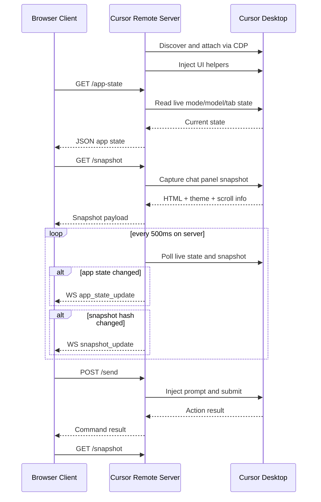

# Cursor Remote

<p align="center">
  
</p>

<p align="center">
  Browser-based remote control and live mirror for the active Cursor chat session.
</p>

<p align="center">
  <a href="#1-executive-summary">Executive Summary</a> |
  <a href="#2-product-scope">Product Scope</a> |
  <a href="#3-key-capabilities">Key Capabilities</a> |
  <a href="#4-how-the-product-works">How the Product Works</a> |
  <a href="#5-primary-product-flows">Primary Product Flows</a> |
  <a href="#6-architecture">Architecture</a> |
  <a href="#7-installation-and-quick-start">Installation</a> |
  <a href="#8-configuration">Configuration</a> |
  <a href="#9-api-reference">API Reference</a> |
  <a href="#10-operations-and-observability">Operations</a> |
  <a href="#11-testing-and-quality-gates">Testing</a> |
  <a href="#12-security-model">Security</a> |
  <a href="#13-known-limitations-and-trade-offs">Limitations</a>
</p>

---

## 1. Executive Summary

Cursor Remote turns a live Cursor desktop session into a remotely accessible web product.

The project attaches to Cursor through the Chrome DevTools Protocol (CDP), reads the live UI state from the Electron-rendered chat interface, and exposes a browser dashboard that can:

- mirror the active conversation
- send prompts back into Cursor
- switch mode and model
- browse and select history
- open or switch chat tabs
- upload files into the active conversation
- stop generation
- recover from connection loss

The design goal is practical operational control, not a generic chat clone. The desktop Cursor window remains the source of truth. The web client is a synchronized remote surface layered on top of that source.

---

## 2. Product Scope

### 2.1 What the product is

Cursor Remote is a local-first control plane for Cursor chat workflows. It is optimized for:

- using a phone as a secondary control surface
- monitoring an ongoing Cursor task from another device
- triggering common chat actions without sitting at the desktop
- preserving a Cursor-like visual model instead of building a separate AI product

### 2.2 What the product is not

Cursor Remote is not:

- a standalone AI inference backend
- a database-backed chat platform
- a replacement for Cursor authentication or workspace security
- a public internet SaaS with hardened edge security

### 2.3 Target usage model

The primary usage model is:

1. Cursor runs on a desktop machine.
2. Cursor Remote runs on the same machine and attaches to Cursor over CDP.
3. A browser on the same machine or same network connects to Cursor Remote over HTTP or HTTPS.
4. The browser mirrors and controls the active Cursor conversation.

---

## 3. Key Capabilities

### 3.1 User-facing capabilities

| Capability | Description | Source of truth |
| --- | --- | --- |
| Live chat mirror | Renders the active Cursor chat as a remotely viewable web UI | Cursor DOM |
| Prompt submission | Sends a prompt into the active Cursor composer and submits it | Cursor editor and send action |
| Mode switching | Switches among `Agent`, `Plan`, `Debug`, and `Ask` | Cursor mode chip and dropdown |
| Model switching | Reads available models and applies the requested model remotely | Cursor model chip and dropdown |
| Model toggles | Handles `Auto`, `MAX Mode`, and `Use Multiple Models` toggles when available | Cursor model menu |
| Stop generation | Stops a running agent or model response | Cursor stop control |
| Chat history | Opens history, reads recent conversations, and allows selecting one | Cursor history UI |
| Chat tabs | Reads open tabs, active tab, and allows switching between them | Cursor tab strip |
| New chat | Starts a new conversation remotely | Cursor new chat control |
| File upload | Accepts a local file from the browser and injects it into Cursor | Browser upload + Cursor file input |
| Scroll sync | Sends browser scroll intent back to Cursor and refreshes the mirrored view | Cursor scroll container |
| Restart assist | Restarts Cursor with CDP when automation cannot attach | Local process control |

### 3.2 Operator-facing capabilities

| Capability | Description |
| --- | --- |
| Health endpoint | Reports uptime, HTTPS state, CDP state, and runtime mode |
| QR bootstrap | Generates a ready-to-scan mobile connection URL |
| Request logging | Logs every HTTP request with timing and sanitized URLs |
| WebSocket auth | Rejects unauthorized real-time clients |
| Snapshot caching | Keeps the last valid snapshot in memory for fast retrieval |
| App state caching | Keeps the last valid mode/model/tab state in memory for fallback recovery |
| Debug endpoints | Exposes UI inspection endpoints for CDP troubleshooting |

### 3.3 UX behaviors

| Behavior | Description |
| --- | --- |
| Lightweight WebSocket sync | WebSocket broadcasts only small change notifications; full snapshots are fetched over HTTP |
| Defensive polling | Client still revalidates state and snapshot periodically even if WebSocket misses an event |
| Cursor-style layout | The browser UI intentionally mirrors Cursor structure rather than inventing a separate shell |
| Mobile-first ergonomics | The web UI is tuned for touch, narrow screens, sticky input, and compact action chips |
| Theme awareness | Snapshot rendering honors Cursor theme colors and text palette |

---

## 4. How the Product Works

### 4.1 Source-of-truth model

The desktop Cursor window is the authoritative system state.

Cursor Remote does not persist product state in a database. Instead it maintains two in-memory caches:

- `lastAppState`: the latest validated logical UI state such as mode, model, active chat, and tabs
- `lastSnapshot`: the latest captured visual snapshot of the chat panel

These caches exist only to make synchronization resilient and to avoid unnecessary re-fetching. They are not independent business objects.

### 4.2 Transport model

The product deliberately splits control and synchronization across two channels:

- REST for commands and large payload retrieval
- WebSocket for lightweight change notifications

This is a key design choice:

- commands remain explicit and debuggable
- WebSocket traffic stays small
- large HTML snapshots do not need to be pushed repeatedly over the socket

### 4.3 Synchronization strategy

The runtime uses both server polling and client-side revalidation:

Server side:

- attaches to Cursor over CDP
- polls live UI state every `500ms`
- captures app state and snapshots
- computes hashes
- broadcasts only when something actually changes

Client side:

- connects to WebSocket on load
- fetches `/app-state` every `5s`
- revalidates snapshot every `4s`
- checks chat status every `10s`
- requests a fresh snapshot immediately after relevant actions

This dual strategy is intentional. It protects the UI from missed WebSocket messages, transient CDP read failures, and asynchronous Cursor animation timing.

### 4.4 Snapshot model

The snapshot endpoint returns a render-focused payload. At the time of writing, the payload includes:

- `html`
- `css`
- `backgroundColor`
- `bodyBackgroundColor`
- `color`
- `bodyColor`
- `fontFamily`
- `themeVars`
- `scrollInfo`
- `stats`
- `chatTabs`
- `activeChatTitle`
- `hash`
- `capturedAt`

Important note:

- the snapshot is primarily HTML plus theme metadata
- `css` currently exists as a field but is not the main styling source
- the browser UI applies its own client-side parity styling on top of the mirrored DOM

---

## 5. Primary Product Flows

### 5.1 Startup and desktop attach flow

1. The launcher or manual start boots the Node.js server.
2. The server ensures HTTPS certificates are available unless running in embedded mode.
3. The server scans candidate CDP ports `9000-9003`.
4. It verifies that the target is actually Cursor, not just any Electron app.
5. If Cursor is unavailable, the launcher can prepare `argv.json`, start Cursor with remote debugging, and wait for CDP readiness.
6. Once attached, the server injects DOM helper utilities into Cursor contexts.
7. Polling begins and the browser client can load.

### 5.2 Authentication and session establishment flow

1. Remote users open the web UI.
2. Localhost traffic can bypass auth for convenience.
3. Remote clients authenticate either by:
   - submitting the password to `/login`
   - opening the QR/bootstrap URL with `?key=<APP_PASSWORD>`
4. The server signs and stores an HTTP-only auth cookie.
5. WebSocket access is allowed only if the cookie or localhost rule validates.

### 5.3 Live monitoring flow

1. Browser opens the dashboard.
2. Browser connects to WebSocket.
3. Browser fetches `/app-state`.
4. Browser fetches `/snapshot`.
5. Server keeps polling Cursor.
6. On logical changes, server emits `app_state_update`.
7. On visual changes, server emits `snapshot_update` with a hash.
8. Browser fetches the new snapshot only when needed.

### 5.4 Prompt submission flow

1. User enters text in the web composer.
2. Client sends `POST /send`.
3. Server injects the message into the active Cursor editor.
4. Server triggers the appropriate send action in Cursor.
5. Browser re-fetches state and snapshot until the UI reflects the new conversation state.

### 5.5 Mode and model switching flow

1. Browser opens the remote dropdown.
2. Browser fetches `/dropdown-options?kind=mode` or `kind=model`.
3. Server reads the actual available options from the live Cursor dropdown.
4. User selects an option.
5. Browser sends `POST /set-mode`, `POST /set-model`, or `POST /set-model-toggle`.
6. Server applies the selection in Cursor and verifies the result.
7. Browser re-syncs from `/app-state`.

This verification step is critical because Cursor UI state can change asynchronously and menus can be ambiguous if not read carefully.

### 5.6 Chat history and tab flow

1. Browser requests `/chat-history`.
2. Server opens the Cursor history UI, reads recent items, and returns titles.
3. Browser selects a target title with `POST /select-chat`.
4. Server either switches via chat tab or the history target.
5. Browser refreshes state and snapshot after the desktop transition settles.

Open chat tabs are handled separately from history. They are treated as first-class runtime state because the active tab changes what snapshot should be shown.

### 5.7 File upload flow

1. Browser selects a file.
2. Client sends `multipart/form-data` to `/upload`.
3. Server stores the file in `uploads/`.
4. Server injects the file into Cursor using the available DOM/file chooser path.
5. Browser refreshes state after the desktop UI updates.

### 5.8 Recovery and reconnect flow

If CDP disconnects or Cursor restarts:

1. Web UI remains available.
2. `/app-state` returns best-effort fallbacks or unknown state.
3. Browser keeps polling and reconnecting.
4. Operator can trigger `/restart-cursor-cdp` or relaunch via `run.bat`.
5. Once Cursor is back, polling and snapshot capture resume.

### 5.9 Sequence diagram



---

## 6. Architecture

### 6.1 Runtime topology

```text
+-----------------------+        HTTPS / WSS         +---------------------------+        CDP         +------------------+
| Browser / Mobile UI   | <-----------------------> | Node.js server            | <----------------> | Cursor Desktop   |
| public/index.html     |                           | Express + WebSocket + CDP |                    | Electron UI      |
| public/js/app.js      |                           | server.js orchestration    |                    | active workspace |
+-----------------------+                           +---------------------------+                    +------------------+
```

### 6.2 Architectural split

The codebase follows a practical split:

- `server.js`
  - CDP discovery and connection lifecycle
  - Cursor helper injection
  - DOM parsing and action automation
  - polling loop
  - snapshot capture
  - process management helpers
- `src/server/http/create-server.js`
  - Express/HTTPS/WebSocket assembly
- `src/server/http/auth.js`
  - request auth and WebSocket auth
  - request logging
- `src/server/http/routes/*.js`
  - HTTP route registration
- `public/*`
  - browser UI
  - synchronization and remote control logic

### 6.3 Important directories and files

```text
.
|-- server.js
|-- run.bat
|-- generate_ssl.js
|-- smoke-test.js
|-- ui_inspector.js
|-- package.json
|-- .env.example
|-- public/
|   |-- index.html
|   |-- login.html
|   |-- css/style.css
|   `-- js/app.js
|-- src/server/http/
|   |-- auth.js
|   |-- create-server.js
|   `-- routes/
|       |-- cursor.js
|       `-- system.js
|-- certs/        # generated at runtime
|-- uploads/      # generated at runtime
|-- output/       # generated test artifacts
`-- *.log         # generated runtime and debug logs
```

### 6.4 Frontend responsibilities

The browser client is responsible for:

- login and cookie-based session handling
- WebSocket connection lifecycle
- periodic app-state refresh
- periodic snapshot revalidation
- rendering snapshot DOM safely into the mirrored shell
- chat history modal interactions
- file upload UX
- mode/model dropdown UX
- scroll capture and remote scroll requests

### 6.5 Backend responsibilities

The server is responsible for:

- HTTPS bootstrapping
- auth enforcement
- request logging
- CDP discovery and attach
- Cursor launch assistance
- all live DOM reads and writes
- snapshot generation
- app-state generation
- WebSocket broadcasting

---

## 7. Installation and Quick Start

### 7.1 Prerequisites

| Requirement | Notes |
| --- | --- |
| Node.js `>=16` | The project is currently running well on Node 22 in local testing |
| Cursor Desktop | Must be installed locally |
| Windows 10/11 | Primary supported launcher flow |
| Same LAN for mobile access | Required if using another device |

### 7.2 Recommended start path

Use the Windows launcher:

```bat
run.bat
```

The launcher performs:

1. runtime tool validation
2. dependency validation
3. environment and HTTPS preparation
4. Cursor workspace discovery
5. Cursor CDP verification or launch
6. server port selection and cleanup
7. project launch and readiness checks

### 7.3 Useful launcher flags

| Flag | Meaning |
| --- | --- |
| `--server-only` or `-s` | Skip desktop wrapper logic and run web server only |
| `--desktop` | Force desktop-wrapper launch mode if that runtime is available |
| `--dev` / `--hot` / `--watch` | Start with `nodemon` |
| `--port <N>` | Request a specific app port |
| `--no-open` | Do not open a browser automatically |
| `--no-verify` | Skip startup readiness verification |
| `--detach` | Start and release the launcher window |
| `--hold` | Keep the launcher attached to the host process |

### 7.4 Manual start path

If you do not want to use `run.bat`:

```bash
npm install
node server.js
```

Then open:

```text
https://127.0.0.1:3000
```

Important:

- browser mode prefers HTTPS
- CDP must be available from Cursor
- if Cursor is not already exposing remote debugging, the launcher path is easier

### 7.5 Development mode

```bash
npm run dev
```

### 7.6 Mobile connection

1. Start the project on the desktop machine.
2. Ensure the phone is on the same network.
3. Use `/qr-info` or the terminal URL to open the app from the phone.
4. Accept the self-signed certificate if prompted.
5. Authenticate if the request is not considered local.

---

## 8. Configuration

### 8.1 Environment variables in active runtime

| Variable | Default | Purpose |
| --- | --- | --- |
| `PORT` | `3000` | Main app port |
| `APP_PASSWORD` | `Cursor` | Password used for remote login and QR bootstrap |
| `SESSION_SECRET` | `cursor_secret_key_1337` | Cookie signing secret |
| `AUTH_SALT` | `cursor_default_salt_99` | Salt used to derive the auth token |
| `CR_SKIP_AUTO_LAUNCH` | `0` | When `1`, disables Cursor auto-launch behavior |
| `CR_VISIBLE_CURSOR` | `0` in server, `1` in launcher | Forces Cursor window visibility behavior |
| `CR_TERMINAL_LOG` | `1` in server, `0` in launcher child process | Enables or suppresses terminal logging |
| `TAURI_EMBEDDED` | `0` | Enables embedded runtime mode when provided by a wrapper |

### 8.2 Variables present in `.env.example`

The template also contains:

- `NGROK_AUTHTOKEN`

This value is currently documented in the example file but is not actively consumed by the present runtime code path.

### 8.3 Ports

| Port range | Purpose |
| --- | --- |
| `3000+` | Cursor Remote web server |
| `3001+` | HTTP to HTTPS redirect port when HTTPS is enabled |
| `9000-9003` | Candidate Cursor CDP ports |

### 8.4 HTTPS behavior

Browser runtime:

- prefers HTTPS
- auto-generates self-signed certificates if needed
- can expose an HTTP redirect on `PORT + 1`

Embedded runtime:

- may intentionally stay on local HTTP for wrapper compatibility

---

## 9. API Reference

## 9.1 Authentication rules

All non-public endpoints are protected unless one of the following is true:

- the request comes from localhost
- the request includes a valid signed auth cookie
- the request enters with `?key=<APP_PASSWORD>` and is upgraded to a cookie-backed session

Public paths currently include:

- `/login`
- `/login.html`
- `/favicon.ico`
- `/logo.png`
- static CSS assets

### 9.2 System endpoints

| Method | Endpoint | Description |
| --- | --- | --- |
| `POST` | `/login` | Authenticate with `APP_PASSWORD` |
| `POST` | `/logout` | Clear auth cookie |
| `GET` | `/snapshot` | Return latest validated visual snapshot for a live chat |
| `GET` | `/health` | Health, uptime, HTTPS, runtime mode, and CDP status |
| `GET` | `/qr-info` | Return `connectUrl`, `qrDataUrl`, IP, port, and protocol |
| `GET` | `/ssl-status` | Return HTTPS readiness and certificate status |
| `POST` | `/generate-ssl` | Generate local certificates |
| `GET` | `/debug-ui` | Dump inspected UI tree from the active CDP target |
| `GET` | `/ui-inspect` | Multi-context DOM inspection report |
| `GET` | `/cdp-targets` | Raw CDP target listing across candidate ports |

### 9.3 Cursor control endpoints

| Method | Endpoint | Request body | Description |
| --- | --- | --- | --- |
| `POST` | `/send` | `{ "message": "..." }` | Inject and submit a prompt |
| `POST` | `/stop` | none | Stop active generation |
| `POST` | `/set-mode` | `{ "mode": "Agent" }` | Change mode |
| `POST` | `/set-model` | `{ "model": "Auto" }` | Change model |
| `POST` | `/set-model-toggle` | `{ "key": "auto", "enabled": true }` | Toggle model menu settings |
| `POST` | `/new-chat` | none | Start a new conversation |
| `POST` | `/restart-cursor-cdp` | none | Restart or relaunch Cursor with CDP |
| `POST` | `/select-chat` | `{ "title": "..." }` | Switch to a target chat |
| `POST` | `/close-history` | none | Close the history panel |
| `POST` | `/remote-click` | `{ "selector": "...", "index": 0, "textContent": "..." }` | Replay a click into Cursor |
| `POST` | `/remote-scroll` | `{ "scrollTop": 0, "scrollPercent": 0.5 }` | Request desktop scroll sync |
| `POST` | `/upload` | multipart form | Upload and inject a file |

### 9.4 State and discovery endpoints

| Method | Endpoint | Description |
| --- | --- | --- |
| `GET` | `/app-state` | Return mode, model, busy state, tabs, active title, and chat availability |
| `GET` | `/dropdown-options?kind=mode` | Return live mode options |
| `GET` | `/dropdown-options?kind=model` | Return live model options and toggle state |
| `GET` | `/chat-history` | Return recent conversations |
| `GET` | `/chat-status` | Quick check for panel/editor/chat presence |

### 9.5 WebSocket events

| Event | Direction | Payload | Purpose |
| --- | --- | --- | --- |
| `app_state_update` | server to client | `{ hash, state }` | Push logical state changes |
| `snapshot_update` | server to client | `{ hash }` | Notify the client that a fresh snapshot should be fetched |
| `error` | server to client | `{ message }` | Authentication or connection failure |

### 9.6 Example responses

#### `GET /health`

```json
{
  "status": "ok",
  "cdpConnected": true,
  "uptime": 172.42,
  "timestamp": "2026-03-10T03:45:00.000Z",
  "https": true,
  "embedded": false
}
```

#### `GET /app-state`

```json
{
  "mode": "Ask",
  "model": "Auto",
  "isRunning": false,
  "composerStatus": "completed",
  "hasChat": true,
  "hasMessages": true,
  "editorFound": true,
  "activeChatTitle": "Investigate mode sync regression",
  "chatTabs": [
    { "title": "Investigate mode sync regression", "active": true },
    { "title": "Parity check reference", "active": false }
  ]
}
```

#### `GET /snapshot`

```json
{
  "html": "<div>...</div>",
  "css": "",
  "backgroundColor": "rgb(17, 18, 21)",
  "color": "rgb(224, 224, 228)",
  "fontFamily": "Segoe UI, sans-serif",
  "themeVars": {
    "--vscode-editor-background": "#111215"
  },
  "scrollInfo": {
    "scrollTop": 1200,
    "scrollHeight": 3200,
    "clientHeight": 900,
    "scrollPercent": 0.52
  },
  "stats": {
    "nodes": 342,
    "htmlSize": 15360,
    "cssSize": 0
  },
  "chatTabs": [
    { "title": "Investigate mode sync regression", "active": true }
  ],
  "activeChatTitle": "Investigate mode sync regression",
  "hash": "abc123",
  "capturedAt": "2026-03-10T03:45:00.000Z"
}
```

---

## 10. Operations and Observability

### 10.1 Runtime artifacts

The application intentionally generates local runtime artifacts that are already covered by `.gitignore`:

| Path or pattern | Purpose |
| --- | --- |
| `certs/` | generated HTTPS certificates |
| `uploads/` | uploaded browser files before injection |
| `*.log` | runtime and debug logs |
| `log.txt`, `log.old.txt` | launcher log files |
| `.playwright-cli/` | browser automation artifacts |
| `output/` | test outputs and temporary verification files |

### 10.2 Logs you will commonly use

| File pattern | Typical use |
| --- | --- |
| `log.txt` | launcher timeline |
| `cursor-launch.stdout.log` | visible Cursor launch output |
| `cursor-launch.stderr.log` | Cursor launch errors |
| `cursor-remote.log` | long-running server runtime log |
| task-specific `*.log` files | focused debugging for regressions and verification steps |

### 10.3 Health and debug workflow

Recommended order when the product misbehaves:

1. `GET /health`
2. `GET /app-state`
3. `GET /snapshot`
4. `GET /chat-status`
5. `GET /ui-inspect`
6. `GET /cdp-targets`

### 10.4 Operational design choices

The product intentionally prefers:

- in-memory caches instead of persistent state
- deterministic HTTP commands instead of multiplexed action sockets
- lightweight WebSocket broadcasts instead of pushing full HTML payloads
- aggressive verification around mode, model, tabs, and snapshot freshness

---

## 11. Testing and Quality Gates

### 11.1 Included automated smoke test

```bash
npm run smoke
```

Current smoke coverage:

- `GET /health`
- `GET /`

### 11.2 Recommended local regression checklist

Before shipping behavior changes, verify at least:

1. The server starts and `/health` returns `status: ok`.
2. The browser UI loads the active chat snapshot.
3. Sending a prompt works.
4. Switching mode works.
5. Switching model works if the model menu is present.
6. History opens and selecting a chat updates the snapshot.
7. Chat tabs stay aligned with the active conversation.
8. Upload works for at least one file.
9. Scroll sync remains stable after manual scrolling.
10. Reconnect behavior is acceptable after restarting Cursor.

### 11.3 Manual browser automation

The repository already supports Playwright-based manual regression work. Generated artifacts should stay under ignored runtime directories such as:

- `.playwright-cli/`
- `output/`

---

## 12. Security Model

### 12.1 Security controls present today

| Control | Description |
| --- | --- |
| Signed auth cookie | Session is stored as a signed cookie |
| HTTP-only cookie | Browser scripts cannot read the auth token directly |
| Password gate | Remote users must know `APP_PASSWORD` |
| Localhost bypass | Improves local ergonomics but should not be treated as public-internet security |
| WebSocket auth | Reuses the same auth model for real-time channels |
| HTTPS support | Self-signed TLS reduces plaintext LAN exposure |
| Sanitized upload names | Upload filenames are normalized before being stored |
| Request logging | Helps trace suspicious or failing requests |

### 12.2 Security assumptions

The current design assumes:

- the host machine is trusted
- the local network is semi-trusted at best
- exposure to the public internet is not the default operating model

### 12.3 Security caveats

You should treat the project as operator tooling, not a hardened public gateway. In particular:

- localhost bypass is convenient but not suitable for internet-facing deployment
- self-signed certs are operationally acceptable for local use, not enterprise PKI
- the product automates a live desktop application, so any compromise of the host is high impact

---

## 13. Known Limitations and Trade-offs

| Area | Limitation |
| --- | --- |
| DOM coupling | The automation logic depends on Cursor UI structure and can break when Cursor changes selectors or layout |
| Platform bias | Windows launcher flow is the most complete path today |
| Browser trust | First-time HTTPS access requires accepting a local certificate warning |
| No persistent state | Reboots clear in-memory snapshot and app-state cache |
| No multi-user coordination | The product reflects one live desktop source, not multiple independent operator sessions |
| No backend authorization model | There are no role-based permissions or per-user scopes |
| Snapshot fidelity | The mirrored UI is intentionally close to Cursor, but still depends on client-side parity styling |

### 13.1 Intentional trade-offs

Some of these limitations are deliberate:

- tighter coupling to Cursor gives better runtime parity
- in-memory state keeps the product simple and fast
- direct DOM automation avoids building a second AI protocol layer

---

## 14. Compatibility Notes

| Surface | Status |
| --- | --- |
| Windows launcher | first-class |
| Browser runtime | first-class |
| Mobile browser control | first-class on same LAN |
| Embedded runtime hooks | available in code, but wrapper-specific |
| Linux and macOS | possible with manual setup, less operationally optimized than Windows launcher flow |

Note:

- `package.json` includes Tauri-related scripts and embedded runtime hooks
- this repository snapshot is still primarily operated as a browser-served product

---

## 15. Development Notes

### 15.1 Useful scripts

```bash
npm start
npm run dev
npm run smoke
```

### 15.2 Where to extend the product

| Goal | Primary file |
| --- | --- |
| add or harden CDP automation | `server.js` |
| add new HTTP routes | `src/server/http/routes/*.js` |
| adjust auth behavior | `src/server/http/auth.js` |
| change frontend UX | `public/js/app.js` and `public/css/style.css` |
| inspect broken Cursor selectors | `ui_inspector.js` and `/ui-inspect` |

### 15.3 Documentation maintenance rule

If runtime behavior changes, update this README in the same workstream. The sections most likely to become stale are:

- supported modes and model toggles
- launcher behavior
- API surface
- snapshot payload shape
- compatibility notes

---

## 16. License

This project is licensed under `GPL-3.0-only`.
